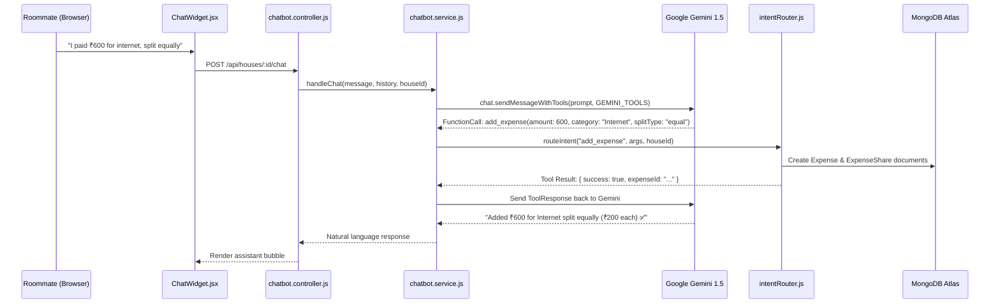

# Technical Design Document (TDD)

**Project Name:** SplitStay (Shared Roommate Expense Tracker with Conversational AI)

---

## 1. Problem Statement

A standard personal expense tracker operates on a single-user ledger. Communal living requires *shared* budgets: multiple roommates belong to a single "house" entity, where any member can log an expense that must be split accurately among all members — with the backend tracking net running balances and minimal settlement pathways.

---

## 2. Solution Overview

- **Grouping:** A `House` document links multiple `User` documents via `HouseMember` references.
- **Shared Logging:** Expenses belong to a house (not an isolated individual), recording the payer and category.
- **Automatic Splitting:** Each expense creates `ExpenseShare` records — one per member — capturing their exact debt share under equal, exact, or percentage split formulas.
- **Balance Netting:** A dedicated balance service (`balanceEngine.js`) nets total amounts paid against total owed across all expense shares and recorded settlements.
- **Debt Simplification:** An optimization algorithm (`debtSimplifier.js`) guarantees that all house debts can be settled in the minimal number of transactions ($N - 1$).
- **Settlement:** A `Settlement` model records peer-to-peer payments to adjust running balances in real time.
- **Conversational Layer:** An AI chatbot service (`chatbot.service.js`) routes natural language requests to internal deterministic services using LLM tool function calling.

---

## 3. Tech Stack

- **Frontend:**
  - React 18 (Vite 5)
  - Styling: Tailwind CSS + Vanilla CSS Tokens
  - Visuals & 3D Shaders: OGL WebGL library (`Orb.jsx`, `Galaxy.jsx`, `Lightfall.jsx` components)
  - Icons: Lucide React
  - Networking & State: Axios with Bearer Interceptors, React Context API (`AuthContext.jsx`)
- **Backend:**
  - Runtime: Node.js with Express.js REST API
  - Database: MongoDB Atlas with Mongoose ODM
  - Authentication: JWT (JSON Web Tokens) with signed payloads + Passport.js (Google OAuth 2.0)
  - Notifications: Resend API for transactional invite and balance emails
- **AI Chatbot Service:**
  - Google Gemini 1.5 Pro / Flash with native Tool Function Calling and RAG context retrieval

---

## 4. API Design

| Method | Endpoint | Description | Auth Required |
|---|---|---|---|
| POST | `/api/auth/register` | Create a new user account with hashed password. | No |
| POST | `/api/auth/login` | Authenticate credentials and return signed JWT token. | No |
| GET | `/api/auth/me` | Fetch authenticated user profile. | Yes |
| GET | `/api/auth/google` | Initiate Google OAuth 2.0 authentication flow. | No |
| POST | `/api/auth/forgot-password` | Generate password reset token and email link. | No |
| POST | `/api/auth/reset-password/:token` | Reset user password using verified token. | No |
| GET | `/api/houses` | List all houses the authenticated user belongs to. | Yes |
| POST | `/api/houses` | Create a new house and set creator as first member. | Yes |
| POST | `/api/houses/join` | Join an existing house via invite code. | Yes |
| GET | `/api/houses/:id` | Get details and metadata for a specific house. | Yes (`requireHouseMember`) |
| GET | `/api/houses/:id/members` | List all verified members in a house. | Yes (`requireHouseMember`) |
| PUT | `/api/houses/:id/currency` | Update house default currency (INR, USD, EUR, GBP). | Yes (`requireHouseMember`) |
| GET | `/api/houses/:id/expenses` | Fetch paginated expense history with search/filters. | Yes (`requireHouseMember`) |
| POST | `/api/houses/:id/expenses` | Add a new shared expense with split share calculations. | Yes (`requireHouseMember`) |
| POST | `/api/houses/:id/expenses/scan-receipt` | Parse receipt photo using Gemini Vision OCR. | Yes (`requireHouseMember`) |
| DELETE | `/api/expenses/:id` | Delete an expense and cascade to its shares. | Yes |
| GET | `/api/houses/:id/balances` | Calculate real-time net balances for all house members. | Yes (`requireHouseMember`) |
| POST | `/api/houses/:id/balances/remind` | Send balance reminder emails to debtors via Resend. | Yes (`requireHouseMember`) |
| POST | `/api/houses/:id/settlements` | Record a settlement payment between two house members. | Yes (`requireHouseMember`) |
| GET | `/api/houses/:id/settlements` | List all recorded settlements for a house. | Yes (`requireHouseMember`) |
| POST | `/api/houses/:id/chat` | Process natural-language prompts via Gemini function-calling. | Yes (`requireHouseMember`) |

---

## 5. Database Schema (Mongoose / MongoDB Atlas)

```javascript
// User Schema
const userSchema = new mongoose.Schema({
  name: { type: String, required: true, trim: true },
  email: { type: String, required: true, unique: true, lowercase: true, trim: true },
  password: { type: String }, // Nullable for OAuth users
  googleId: { type: String, sparse: true },
  avatar: { type: String },
  resetPasswordToken: { type: String },
  resetPasswordExpires: { type: Date }
}, { timestamps: true });

// House Schema
const houseSchema = new mongoose.Schema({
  name: { type: String, required: true, trim: true },
  inviteCode: { type: String, required: true, unique: true, uppercase: true },
  currency: { type: String, enum: ['INR', 'USD', 'EUR', 'GBP'], default: 'INR' },
  createdBy: { type: mongoose.Schema.Types.ObjectId, ref: 'User', required: true }
}, { timestamps: true });

// HouseMember Schema
const houseMemberSchema = new mongoose.Schema({
  userId: { type: mongoose.Schema.Types.ObjectId, ref: 'User', required: true },
  houseId: { type: mongoose.Schema.Types.ObjectId, ref: 'House', required: true },
  joinedAt: { type: Date, default: Date.now },
  role: { type: String, enum: ['admin', 'member'], default: 'member' }
}, { timestamps: true });
houseMemberSchema.index({ userId: 1, houseId: 1 }, { unique: true });

// Expense Schema
const expenseSchema = new mongoose.Schema({
  houseId: { type: mongoose.Schema.Types.ObjectId, ref: 'House', required: true },
  paidById: { type: mongoose.Schema.Types.ObjectId, ref: 'User', required: true },
  amount: { type: Number, required: true, min: 0.01 },
  category: {
    type: String,
    required: true,
    enum: ['Rent', 'Groceries', 'Utilities', 'Internet', 'Cooking Gas', 'Entertainment', 'Other']
  },
  description: { type: String, trim: true },
  splitType: { type: String, enum: ['equal', 'custom', 'percentage', 'exact'], default: 'equal' },
  date: { type: Date, default: Date.now }
}, { timestamps: true });

// ExpenseShare Schema
const expenseShareSchema = new mongoose.Schema({
  expenseId: { type: mongoose.Schema.Types.ObjectId, ref: 'Expense', required: true },
  userId: { type: mongoose.Schema.Types.ObjectId, ref: 'User', required: true },
  houseId: { type: mongoose.Schema.Types.ObjectId, ref: 'House', required: true },
  amountOwed: { type: Number, required: true, min: 0 }
}, { timestamps: true });

// Settlement Schema
const settlementSchema = new mongoose.Schema({
  houseId: { type: mongoose.Schema.Types.ObjectId, ref: 'House', required: true },
  fromUserId: { type: mongoose.Schema.Types.ObjectId, ref: 'User', required: true },
  toUserId: { type: mongoose.Schema.Types.ObjectId, ref: 'User', required: true },
  amount: { type: Number, required: true, min: 0.01 },
  date: { type: Date, default: Date.now },
  note: { type: String, trim: true }
}, { timestamps: true });
```

---

## 6. Split Calculation Logic (`splitCalculator.js`)

The split calculator service is responsible for dividing expenses fairly across participants with exact mathematical precision:

1. **Supported Split Types:**
   - **Equal Split:** Divides total amount evenly across all designated members.
   - **Exact Amount Split:** User specifies exact currency values for each member that sum to the total.
   - **Percentage Split:** User allocates percentage shares (e.g. 50%, 25%, 25%) that must sum to 100%.
2. **Residual Fraction Distribution (Zero Floating-Point Drift):**
   - In financial calculations, dividing amounts (e.g. ₹100.00 among 3 people) produces repeating decimals (`33.3333...`).
   - `splitCalculator.js` calculates base integer cents (`Math.floor(totalCents / n)`) and derives the remainder:
     $$\text{Residual} = \text{Total Cents} - (n \times \text{Base Cents})$$
   - The remaining cents/paise are distributed sequentially (1 cent per share) to the initial members until the residual is 0.
   - For percentage splits, residual cents are distributed using the Hamilton / Largest Remainder method based on fractional remainder values.
   - **Guarantee:** $\sum \text{amountOwed} \equiv \text{Total Expense}$ down to the last penny with zero rounding drift.
3. **Automated Testing:**
   - Enforced by unit tests in `splitCalculator.test.js`, testing edge cases such as odd decimal amounts, varying member group sizes, and fractional percentages.

---

## 7. Debt Simplification Engine (`debtSimplifier.js`)

### Formal Guarantee:
> The minimum-cash-flow debt simplification algorithm guarantees that **$N$ house members can always fully settle their collective balances in at most $N - 1$ transactions**, by greedily matching the largest debtor against the largest creditor until all balances reach zero.

### Algorithm Specification:
1. **Netting:** For each member $i$, compute:
   $$\text{NetBalance}_i = (\text{Total Paid by } i) - (\text{Total Owed by } i) + (\text{Settlements Given}) - (\text{Settlements Received})$$
2. **Classification:** Separate members into two priority lists:
   - **Creditors:** $\text{NetBalance} > 0$ (sorted descending by amount).
   - **Debtors:** $\text{NetBalance} < 0$ (sorted ascending by negative magnitude).
3. **Greedy Matching Loop:**
   - Pick the largest debtor $D$ and largest creditor $C$.
   - Transaction amount: $T = \min(|D|, C)$.
   - Record payment: $D \to C \text{ of amount } T$.
   - Update remaining balances: $D \leftarrow D + T$, $C \leftarrow C - T$.
   - Remove any member whose balance reaches zero (within a $0.005$ epsilon threshold).
   - Repeat until both lists are empty.
4. **Result:** Reduces arbitrary circular debts ($O(N^2)$ transfers) to a clean, minimal directed graph of transactions ($O(N)$ transfers).

---

## 8. AI Chatbot Architecture (`chatbot.service.js`)

SplitStay integrates Google Gemini with deterministic tool function calling to provide natural language interactions without financial hallucinations.



### Registered Gemini Tools (`functions.js`):
1. `add_expense`: Log an expense with amount, category, split type, and optional custom shares.
2. `get_balances`: Retrieve real-time member net balances for the current house.
3. `get_settlements`: Retrieve minimal cash flow settlement recommendations.
4. `list_expenses`: Search and filter recent house expense entries.

### Chatbot Guardrails:
- **Zero Direct Database Writes:** Gemini cannot write directly to MongoDB. All state mutations pass through `intentRouter.js` and validated internal services.
- **Strict Role Alternation:** History is scrubbed to guarantee valid `user` $\to$ `model` $\to$ `user` turns, dropping invalid initial system prompts or consecutive model messages.

---

## 9. UI/UX Design System, Accessibility & PWA

- **Glassmorphic Theme:**
  - Dark-mode background using tailwind color tokens (`#0a0a0f`, `#141526`).
  - Frosted-glass container cards (`backdrop-blur-xl`, `bg-white/[0.04]`, `border-white/[0.08]`).
  - Gradient badges and primary action buttons (`linear-gradient(135deg, #6070f5 0%, #a855f7 100%)`).
- **Animated WebGL Shaders (React Bits):**
  - **`Orb.jsx`:** Interactive glowing 3D simplex noise energy ring reacting to mouse movement and hover rotation on authentication screens.
  - **`Galaxy.jsx`:** Dynamic starfield shader with monochrome twinkling stars, rotation, and cursor repulsion physics.
  - **`Lightfall.jsx`:** Radial streak meteor lightfall shader.
- **Dashboard Interface:**
  - Real-time monthly spend counter and personal balance indicator.
  - "Settle Up" modal pre-populating recommended settlement amounts.
- **Split Configuration Tabs:**
  - Interactive toggle between **Equal Split**, **Exact Amount**, and **Percentage Split** with inline validation indicators.
- **Chat Widget (`ChatWidget.jsx`):**
  - Floating bottom-right widget with auto-scroll and quick-prompt suggestion chips (*"Who owes what?"*, *"Add grocery bill"*, *"How to settle?"*).
- **Mobile-First Responsive Design:**
  - Responsive breakpoints (`sm`, `md`, `lg`, `xl`) with mobile-optimized touch targets (minimum 44px hit areas).
  - Floating bottom drawer pattern on small screens for forms and modals.
- **Progressive Web App (PWA) Support:**
  - Service worker caching core frontend application shell for instant subsequent loads.
  - Web App Manifest providing install-to-homescreen capabilities on iOS Safari and Android Chrome.
  - Offline-resilient view allowing roommates to consult cached balance records without network connectivity.
- **Accessibility (a11y):**
  - High-contrast typography adhering to WCAG 2.1 Level AA color standards.
  - Visible keyboard focus rings (`focus-visible:ring-2 focus-visible:ring-brand-500`).
  - Explicit ARIA attributes (`aria-expanded`, `aria-label`, `aria-modal`, `role="dialog"`) on all custom dropdowns, tabs, and modals.

---

## 10. Security & Non-Functional Specifications

1. **Password Security:** Hashed using `bcryptjs` with salt work factor = 10 before saving to MongoDB.
2. **Stateless JWT Authorization:** Signed with HMAC-SHA256 secret (`JWT_SECRET`), 7-day expiration policy (`expiresIn: '7d'`).
3. **House Authorization Boundary:** `house.middleware.js` verifies that the requester's `userId` has an active record in `HouseMember` for the target `houseId`. Unauthorized attempts return `403 Forbidden`.
4. **Repository & Secret Hygiene:** Root `.gitignore` strictly prevents staging of `.env`, `node_modules/`, `dist/`, build artifacts, and debug logs.
5. **Server Resilience:** Server listens on `0.0.0.0` with explicit port conflict listeners (`EADDRINUSE`) and graceful 5-second MongoDB connection timeouts (`serverSelectionTimeoutMS: 5000`).

---

## 11. Testing Strategy

SplitStay incorporates a comprehensive automated test pyramid designed to ensure mathematical accuracy, debt settlement correctness, and edge-case reliability:

```
          / \
         / E2E \       <- Playwright / Manual User Journeys
        /-------\
       /  Integ  \     <- Supertest + In-Memory Mongo API Tests
      /-----------\
     /    Unit     \   <- Jest: splitCalculator, balanceEngine, debtSimplifier
    /---------------\
```

### 1. Unit Testing:
- **`splitCalculator.test.js`:**
  - Equal split division with exact penny/paise distribution (e.g. ₹100.00 / 3 $\to$ [33.34, 33.33, 33.33], sum $\equiv$ 100.00).
  - Percentage split allocation using largest-remainder distribution with validation that percentages must sum to 100%.
  - Custom exact amount allocation matching total amount within 0.01 tolerance.
  - Invariant assertion: zero floating-point accumulation drift across arbitrary decimal sums.
- **`balanceEngine.test.js`:**
  - Mathematical correctness of member net balances: $\text{Total Paid} - \text{Total Owed} + \text{Settlements Given} - \text{Settlements Received}$.
  - Debt simplification validation verifying that $N$ house members settle in at most $N - 1$ transactions.
  - Zero-balance invariance (sum of all net balances in any closed house must always equal 0.00).

### 2. Integration Testing:
- Complete end-to-end financial transaction cycles:
  1. Roommate A creates a house with Roommates B and C.
  2. Roommate A logs a ₹1,200 equal-split expense $\to$ Verify A is owed ₹800, B and C each owe ₹400.
  3. Roommate B records a ₹400 settlement payment to A $\to$ Verify B's balance reaches ₹0.00 and A's balance decreases to +₹400.
  4. Roommate C records a ₹400 settlement payment to A $\to$ Verify all house balances reach exactly ₹0.00.

### 3. Edge-Case Test Scenarios:
- **Zero-Member Expense Attempt:** Submitting an expense to an empty house returns `400 Bad Request` with appropriate validation messaging.
- **Over-Settlement Guard:** Validating that recorded settlements do not exceed outstanding balances without an explicit user override note.
- **Duplicate Settlement Protection:** Idempotency checking to prevent double-submitting settlement payments on slow network taps.
- **Unsettled Member Departure:** Guard logic preventing a member from leaving or being removed from a house while carrying a non-zero net balance.

---

## 12. API Documentation

To ensure transparent integration and developer discoverability, the SplitStay REST API is formally documented using the **OpenAPI 3.0 (Swagger)** specification:

- **Interactive API Documentation:**
  - Accessible via `/api-docs` when running in development mode (via `swagger-ui-express`).
  - Provides a live playground allowing developers to test endpoints, inspect JSON schemas, and review authorization bearer token requirements.
- **Exportable Postman Collection:**
  - A pre-configured `SplitStay_API.postman_collection.json` file is maintained in the repository root.
  - Includes environment variable templates (`{{baseUrl}}`, `{{authToken}}`, `{{houseId}}`), automated pre-request scripts for JWT injection, and saved example responses for all 20+ routes.

---

## 13. Deployment & DevOps

SplitStay is architected for friction-free local execution and automated production deployments:

### 1. Continuous Integration (CI Pipeline):
- **GitHub Actions Workflow (`.github/workflows/ci.yml`):**
  - Triggers on every `push` and `pull_request` to `main` and `develop` branches.
  - **Jobs Executed:**
    1. Code linting and format verification.
    2. Backend automated test suite execution (`npm test` in `splitstay/backend`).
    3. Frontend production bundle build verification (`npm run build` in `splitstay/frontend`).
    4. Staging environment readiness verification.

### 2. Containerization (Docker & Compose):
- **Backend `Dockerfile`:**
  - Lightweight multi-stage Node.js alpine image minimizing attack surface and image size (<150MB).
  - Production dependency installation, non-root user execution (`USER node`), and container health check endpoints (`/health`).
- **`docker-compose.yml` (One-Command Local Setup):**
  - Orchestrates the full SplitStay application stack with a single command (`docker compose up --build`):
    - `splitstay-backend`: Node.js Express server on port 5000.
    - `splitstay-frontend`: Vite / Nginx client on port 3000.
    - `splitstay-mongo`: Local MongoDB 7.0 container with persistent named volume storage.

### 3. Environment Separation:
- **Development (`.env.development`):**
  - Connects to local or sandbox MongoDB cluster, verbose debug logs enabled, CORS configured for `localhost:3000`.
- **Production (`.env.production`):**
  - Secured MongoDB Atlas replica set URI, enforced TLS encryption, production-grade JWT secret keys, and strict CORS origins.

---

## 14. Implementation Sprints & User Stories

### Sprint 1: Infrastructure & Auth (The Foundation)
- **Story 1: Database Setup:** Initialize MongoDB Atlas connection and Mongoose models (`User`, `House`, `HouseMember`, `Expense`, `ExpenseShare`, `Settlement`).
- **Story 2: User Registration:** Register with email and password (bcrypt salt rounds = 10). Return 201 with JWT.
- **Story 3: User Authentication:** Secure login returning JWT and user profile. 401 on invalid credentials.

### Sprint 2: Houses & Shared Expenses (The Build)
- **Story 4: House Creation:** Create house with unique alphanumeric invite code. Creator assigned as admin member.
- **Story 5: Join House:** Join house via invite code; duplicate membership prevented.
- **Story 6: Add Expense with Split Logic:** Support equal, exact, and percentage splits; residual paise distributed evenly with zero loss.
- **Story 7: Fetch Expenses:** Retrieve house expenses protected by `house.middleware.js` with search and pagination.

### Sprint 3: Balances, Settlement & Dashboard (The Polish)
- **Story 8: Balance Calculation:** Compute net balances for all members, netting total paid minus total owed plus settlements.
- **Story 9: Debt Simplification:** Implement greedy minimum-cash-flow algorithm in `debtSimplifier.js` guaranteeing $\le N - 1$ transactions.
- **Story 10: Record Settlement:** Record peer-to-peer settlement, updating running balances immediately.
- **Story 11: Dashboard & UI Polish:** Build glassmorphic dashboard with WebGL auth screens (`Orb.jsx`, `Galaxy.jsx`) and dynamic currency switcher.

### Sprint 4: AI Chatbot Assistant & Vision OCR (The Smart Layer)
- **Story 12: Natural Language Expense Entry:** Gemini parses natural language and executes `add_expense` tool call.
- **Story 13: Conversational Balances:** Query live balance summary conversationally via `get_balances`.
- **Story 14: Settlement Suggestions:** Query `get_settlements` for minimal payment paths.
- **Story 15: Spending Insights (RAG):** Context builder (`ragContext.js`) feeds summarized historical house data to Gemini for spending queries.
- **Story 16: Receipt Vision OCR:** Upload receipt image and auto-extract expense fields via Gemini 1.5 Vision API.
- **Story 17: Chatbot Guardrails:** Ensure tool calls strictly execute internal services with zero direct DB writes.
